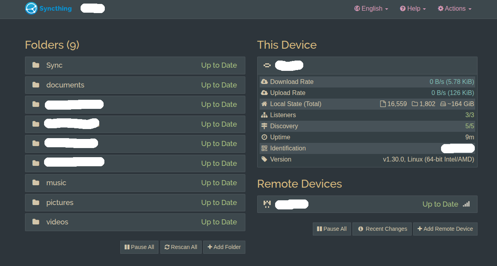
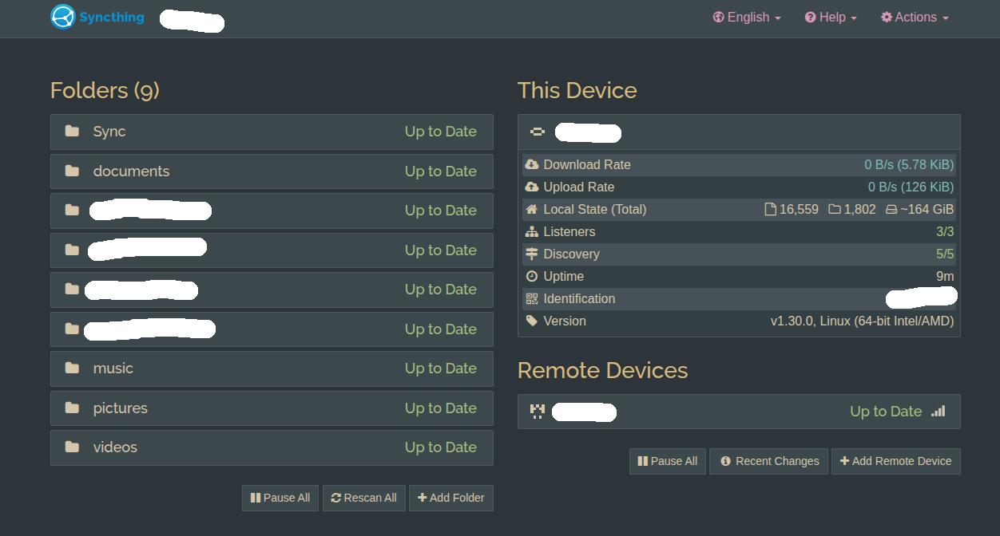
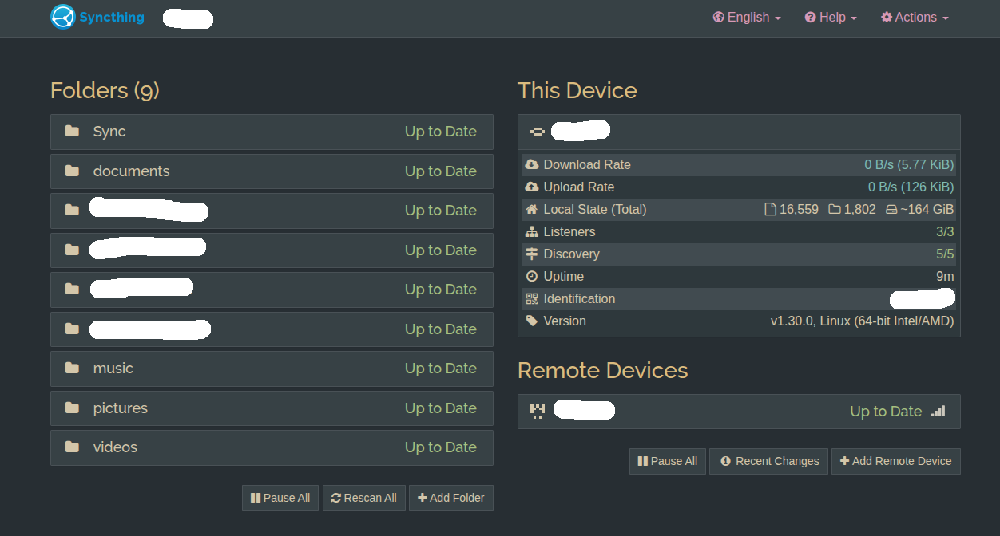

# 🌲 Everforest Dark Themes for Syncthing WebGUI

A set of **Everforest Dark** themes for [Syncthing WebGui](https://syncthing.net/) using the **Dark Medium**, **Dark Soft**, and **Dark Hard** color variants.

You may read the Syncthing Guide on [Changing the GUI Theme](https://docs.syncthing.net/users/faq.html#i-don-t-like-the-gui-or-the-theme-can-it-be-changed) first.

---

## 🎨 Preview

| Variant | Preview |
|----------|--------------|
| **Everforest Dark Medium** |  |
| **Everforest Dark Soft** |  |
| **Everforest Dark Hard** |  |

---

## 📦 Installation

1. Locate your Syncthing GUI assets folder (depends on platform):
   ```
   ~/.config/syncthing/gui/assets/
   ```
   or for system installs:
   ```
   /usr/share/syncthing/gui/assets/
   ```

2. Create one or more subfolders:
   ```
   everforest dark medium/
   everforest dark soft/
   everforest dark hard/
   ```

3. Place the corresponding file:
   ```
   <ThemeName>/assets/css/theme.css
   ```

4. Restart Syncthing → open the Web GUI →
   go to **Settings → GUI → Theme → Select "everforest dark [variant]"**

---

## 🧱 Structure

Each theme defines:
- Full color palette (`:root` CSS variables)
- Bootstrap UI overrides for Syncthing elements (panels, nav, tables, modals)
- Consistent hover, focus, and accent tones

No JavaScript, no layout changes — just clean, drop-in CSS.

---

## 📥 Download / Clone

```bash
git clone https://github.com/<yourname>/syncthing-everforest-themes.git
```

---

## 🪪 License

This project is licensed under the [MIT License](LICENSE).

Color palette © [sainnhe/everforest](https://github.com/sainnhe/everforest)
Syncthing © [The Syncthing Foundation](https://syncthing.net/)

---

## 💚 Credits

- **Theme author:** martelo
- **Base palette:** [Everforest](https://github.com/sainnhe/everforest) by sainnhe
- **Tools used:** Syncthing GUI, Bootstrap 3, ChatGPT 5 (for formatting)

---

## 🚀 Versioning

| Version | Changes |
|----------|----------|
| `v1.0.0` | Initial release (Medium, Soft, Hard variants) |

---

> “A quiet forest is the best desktop background — this theme brings it to your GUI.”
